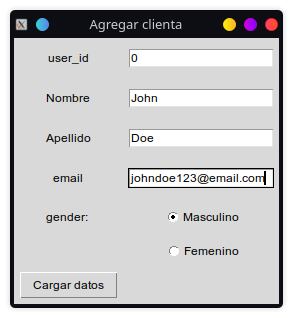
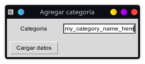

<div id="top"></div>
<!--
*** Thanks for checking out the Best-README-Template. If you have a suggestion
*** that would make this better, please fork the repo and create a pull request
*** or simply open an issue with the tag "enhancement".
*** Don't forget to give the project a star!
*** Thanks again! Now go create something AMAZING! :D
-->


<!-- PROJECT SHIELDS -->
<!--
*** I'm using markdown "reference style" links for readability.
*** Reference links are enclosed in brackets [ ] instead of parentheses ( ).
*** See the bottom of this document for the declaration of the reference variables
*** for contributors-url, forks-url, etc. This is an optional, concise syntax you may use.
*** https://www.markdownguide.org/basic-syntax/#reference-style-links
-->
[![Contributors][contributors-shield]][contributors-url]
[![Forks][forks-shield]][forks-url]
[![Stargazers][stars-shield]][stars-url]
[![Issues][issues-shield]][issues-url]
[![MIT License][license-shield]][license-url]
[![LinkedIn][linkedin-shield]][linkedin-url]


<!-- PROJECT LOGO -->
<br />
<div align="center">
	<a href="https://github.com/KrappRamiro/database-puraesencia">
		
	</a>

<h3 align="center">Base de Datos Pura Esencia</h3>

  <p align="center">
    A relational database made for Pura Esencia, with easy to use and simple-design graphical interface made in tkinter
    <br />
    <a href="https://github.com/KrappRamiro/database-puraesencia"><strong>Explore the docs »</strong></a>
    <br />
    <br />
    <a href="https://github.com/KrappRamiro/database-puraesencia">View Demo</a>
    ·
    <a href="https://github.com/KrappRamiro/database-puraesencia/issues">Report Bug</a>
    ·
    <a href="https://github.com/KrappRamiro/database-puraesencia/issues">Request Feature</a>
  </p>
</div>


<!-- TABLE OF CONTENTS -->
<details>
  <summary>Table of Contents</summary>
  <ol>
    <li>
      <a href="#about-the-project">About The Project</a>
      <ul>
        <li><a href="#built-with">Built With</a></li>
      </ul>
    </li>
    <li>
      <a href="#getting-started">Getting Started</a>
      <ul>
        <li><a href="#prerequisites">Prerequisites</a></li>
        <li><a href="#installation">Installation</a></li>
      </ul>
    </li>
    <li><a href="#usage">Usage</a></li>
    <li><a href="#roadmap">Roadmap</a></li>
    <li><a href="#contributing">Contributing</a></li>
    <li><a href="#license">License</a></li>
    <li><a href="#contact">Contact</a></li>
    <li><a href="#acknowledgments">Acknowledgments</a></li>
  </ol>
</details>


<!-- ABOUT THE PROJECT -->
## About The Project

<div align="center">
	<a href="https://github.com/KrappRamiro/database-puraesencia">
		
	</a>
</div>

The project itself is an application built around a relational database for 
Pura Esencia's Estheticy business.
It allows adding information about clients, products, making categorys for the products, 
adding payment methods, adding personnel and purchase orders.
The database was made in SQLITE using the sqlite3 python library, and it consists in 7 tables:

<div align="center">
	<a href="https://github.com/KrappRamiro/database-puraesencia">
		
	</a>
</div>

Each one of these tables are relationed via foreign keys, which allow for protection of the data integrity and the avoiding of
data repetition, resulting in more efficient systems.

The program was built to help Estheticist staff, with little or null computer skill, to organize
money accounts and monitor client activity.

It shines for its easy and obvious to use GUI

This is my first project independent from any course or tutorial.

<!--Here's a blank template to get started: To avoid retyping too much info. Do a search and replace with your text editor for the following: `KrappRamiro`, `database-puraesencia`, `Ramiro_Krapp`, `Ramiro_Krapp`, `krappramiro.jpg`, `gmail.com`, `Base de Datos Pura Esencia`, `A relational database made for Pura Esencia, with easy to use and simple-design graphical interface made in tkinter` -->

<p align="right">(<a href="#top">back to top</a>)</p>


### Built With

* [Python](https://www.python.org/)
* Love

<p align="right">(<a href="#top">back to top</a>)</p>


<!-- GETTING STARTED -->
## Getting Started

<!--This is an example of how you may give instructions on setting up your project locally.-->
To get a local copy up and running follow these simple steps.

### Prerequisites

You need to have python and tkinter to run the code. 

#### python	

* On Debian-based systems
```sh
sudo apt install python
```

* On Arch-based systems
```sh
sudo pacman -S python
```

#### tkinter
In order to install tkinter, you need to install pip.

* Pip on debian-based systems
```sh
sudo apt install pip
```

* Pip on Arch-based systems
```sh
sudo pacman -S python-pip
```

* tkinter
```sh
pip install tk
```

You can also find tkinter in your distribution repository
### Installation

1. Clone the repo using git
   ```sh
   git clone https://github.com/KrappRamiro/database-puraesencia.git
   ```
2. Install python packages
   ```sh
   pip install tk
   ```
3. run the file main.py`main.py`
   ```sh
   python3 main.py
   ```

<p align="right">(<a href="#top">back to top</a>)</p>


<!-- USAGE EXAMPLES -->
## Usage

<!--Use this space to show useful examples of how a project can be used. Additional screenshots, code examples and demos work well in this space. You may also link to more resources.-->
To add info about something you want, like a customer, category for a product, a product, a proffesional, or a payment method,
you have the add buttons, which are located in the window that opens when you start the program.

### Screenshots of the program

#### Principal menu
<div align="left">
	<a href="https://github.com/KrappRamiro/database-puraesencia">
		
	</a>
</div>

#### Adding a client
<div align="left">
	<a href="https://github.com/KrappRamiro/database-puraesencia">
		
	</a>
</div>

#### Adding a product category
<div align="left">
	<a href="https://github.com/KrappRamiro/database-puraesencia">
		
	</a>
</div>

#### Adding a product
<div align="left">
	<a href="https://github.com/KrappRamiro/database-puraesencia">
		
	</a>
</div>

#### Adding a payment method
<div align="left">
	<a href="https://github.com/KrappRamiro/database-puraesencia">
		
	</a>
</div>

#### Adding a proffesional
<div align="left">
	<a href="https://github.com/KrappRamiro/database-puraesencia">
		
	</a>
</div>

#### Adding a purchase order
<div align="left">
	<a href="https://github.com/KrappRamiro/database-puraesencia">
		
	</a>
</div>


_For more examples, please refer to the [Documentation](https://example.com)_

<p align="right">(<a href="#top">back to top</a>)</p>


<!-- ROADMAP -->
## Roadmap

- [x] Creation feature
	- [x] Client creation
	- [x] Products and categories creation
	- [x] Payment method creation
	- [x] Professionals creation
	- [x] Purchase orders creation
- [ ] Data visualization Feature
	- [ ] Visualization of the spending of each client
	- [ ] Visualization of the monthly & yearly money input/output
	- [ ] Visualization of how much every proffesional makes regularly
- [ ] Data Updating feature
    - [ ] Changing the values that were inputed previusly
- [ ] Data deletion feature

See the [open issues](https://github.com/KrappRamiro/database-puraesencia/issues) for a full list of proposed features (and known issues).

<p align="right">(<a href="#top">back to top</a>)</p>


<!-- CONTRIBUTING -->
## Contributing

Contributions are what make the open source community such an amazing place to learn, inspire, and create. Any contributions you make are **greatly appreciated**.

If you have a suggestion that would make this better, please fork the repo and create a pull request. You can also simply open an issue with the tag "enhancement".
Don't forget to give the project a star! Thanks again!

1. [Fork the Project](https://docs.github.com/en/get-started/quickstart/fork-a-repo)
2. Create your Feature Branch (`git checkout -b feature/AmazingFeature`)
3. Commit your Changes (`git commit -m 'Add some AmazingFeature'`)
4. Push to the Branch (`git push origin feature/AmazingFeature`)
5. [Open a Pull Request](https://docs.github.com/en/pull-requests/collaborating-with-pull-requests/proposing-changes-to-your-work-with-pull-requests/creating-a-pull-request)

<p align="right">(<a href="#top">back to top</a>)</p>


<!-- LICENSE -->
## License

Distributed under the MIT License. See `LICENSE.txt` for more information.

<p align="right">(<a href="#top">back to top</a>)</p>


<!-- CONTACT -->
## Contact

Ramiro Krapp - [@Ramiro_Krapp](https://twitter.com/Ramiro_Krapp) - krappramiro.jpg@gmail.com.com

Project Link: [https://github.com/KrappRamiro/database-puraesencia](https://github.com/KrappRamiro/database-puraesencia)

<p align="right">(<a href="#top">back to top</a>)</p>


<!-- ACKNOWLEDGMENTS -->
## Acknowledgments

* [Othneil Drew's Best README template](https://github.com/othneildrew/Best-README-Template)

<p align="right">(<a href="#top">back to top</a>)</p>


<!-- MARKDOWN LINKS & IMAGES -->
<!-- https://www.markdownguide.org/basic-syntax/#reference-style-links -->
[contributors-shield]: https://img.shields.io/github/contributors/KrappRamiro/database-puraesencia.svg?style=for-the-badge
[contributors-url]: https://github.com/KrappRamiro/database-puraesencia/graphs/contributors
[forks-shield]: https://img.shields.io/github/forks/KrappRamiro/database-puraesencia.svg?style=for-the-badge
[forks-url]: https://github.com/KrappRamiro/database-puraesencia/network/members
[stars-shield]: https://img.shields.io/github/stars/KrappRamiro/database-puraesencia.svg?style=for-the-badge
[stars-url]: https://github.com/KrappRamiro/database-puraesencia/stargazers
[issues-shield]: https://img.shields.io/github/issues/KrappRamiro/database-puraesencia.svg?style=for-the-badge
[issues-url]: https://github.com/KrappRamiro/database-puraesencia/issues
[license-shield]: https://img.shields.io/github/license/KrappRamiro/database-puraesencia.svg?style=for-the-badge
[license-url]: https://github.com/KrappRamiro/database-puraesencia/blob/master/LICENSE.txt
[linkedin-shield]: https://img.shields.io/badge/-LinkedIn-black.svg?style=for-the-badge&logo=linkedin&colorB=555
[linkedin-url]: https://linkedin.com/in/Ramiro_Krapp
[product-screenshot]: images/screenshot.png
